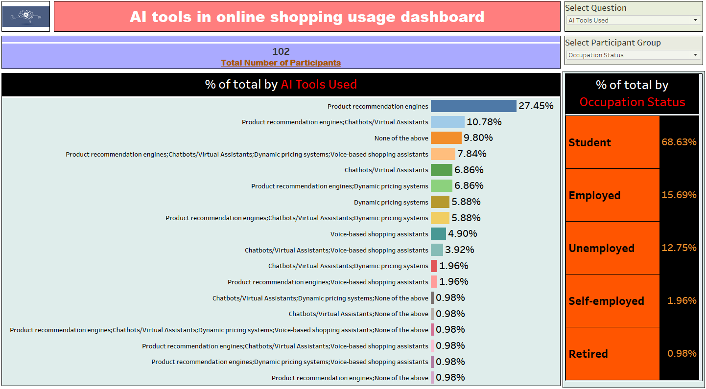
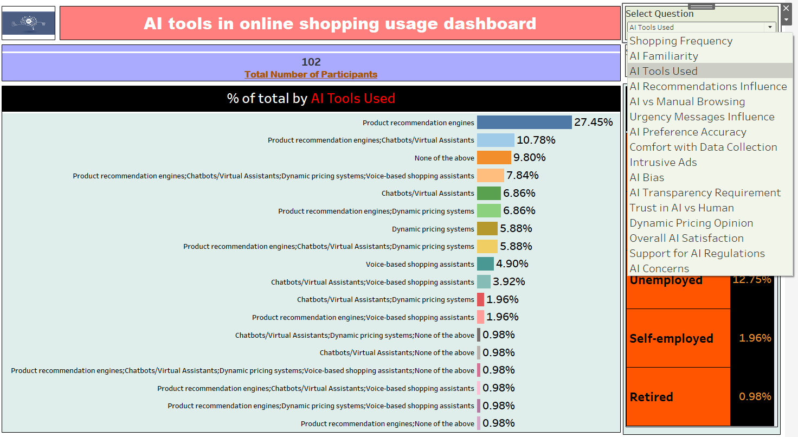
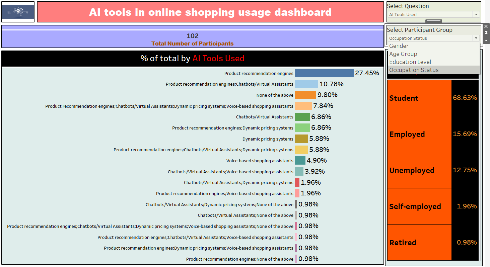
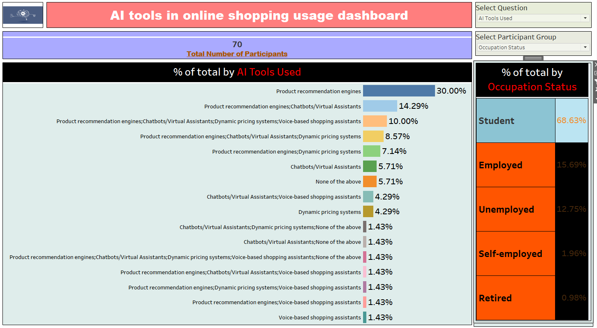
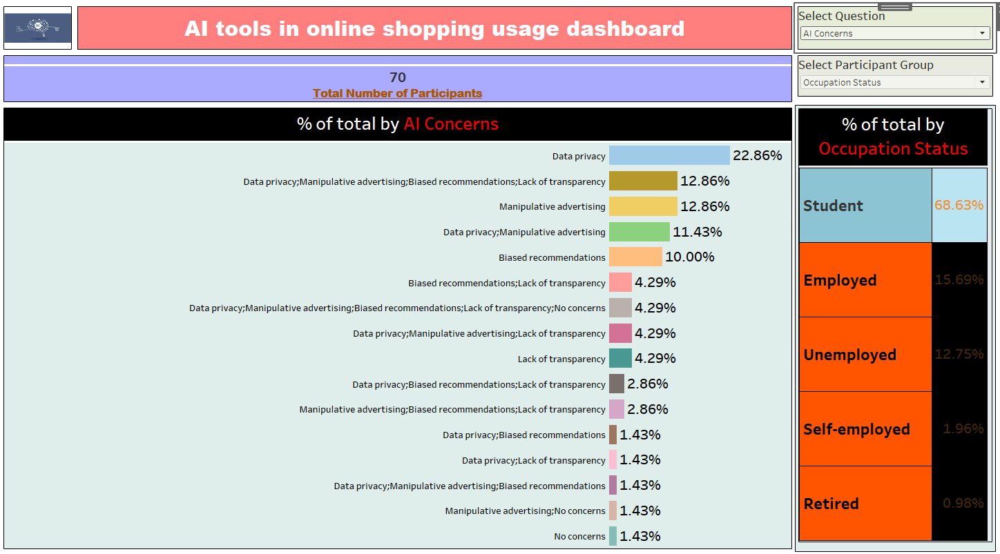

🛒 AI Tools in Online Shopping Usage Dashboard

This repository contains a Tableau project analyzing AI tools usage in online shopping. The dashboard provides insights into how different AI-based tools (such as product recommendation engines, chatbots, dynamic pricing systems, and voice-based shopping assistants) are being adopted by consumers, segmented by demographic and occupational groups.

📊 Project Overview

The dashboard was created to understand consumer interactions with AI tools in online shopping. It explores:

AI Tools Used by participants.

Shopping Behavior & Opinions on AI, including trust, transparency, satisfaction, and concerns.

Participant Demographics, segmented by Gender, Age Group, Education Level, and Occupation Status.

🔑 Features

Interactive Parameters:

Select Question → Allows switching between different survey dimensions (e.g., AI Tools Used, Shopping Frequency, AI Familiarity, AI Bias, Trust in AI, etc.).

Select Participant Group → Enables filtering by demographic groups such as Gender, Age Group, Education Level, or Occupation Status.

Dynamic Filtering:

Table contents are set as interactive filters, allowing users to drill down into specific AI tools or participant categories.

🛠️ Tools & Skills Demonstrated

Tableau → Dashboard creation, parameters, filters, and interactivity.

Data Visualization → Charts, percentage breakdowns, and categorical comparisons.

Analytical Thinking → Segmentation of survey data into meaningful insights.

📌 Key Learnings

How AI tools are perceived and used in online shopping.

Application of parameters in Tableau for dynamic analysis.

Combining demographic segmentation with behavioral insights.

📷 Dashboard Preview

Here are some snapshots of the dashboard:

